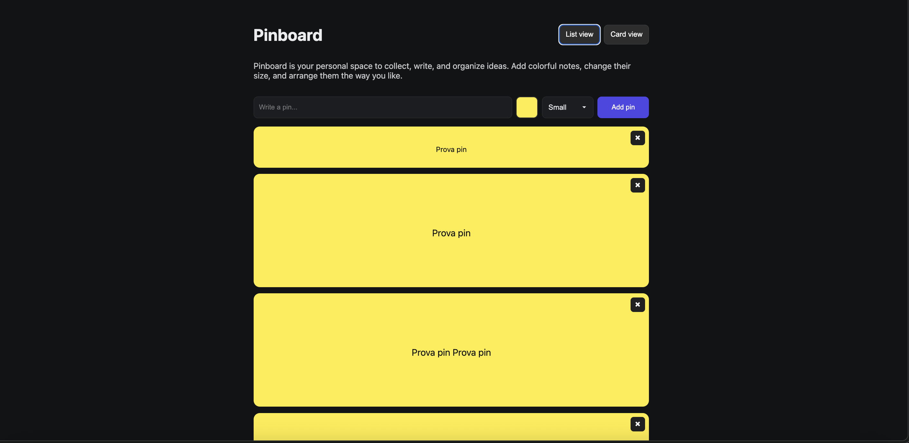
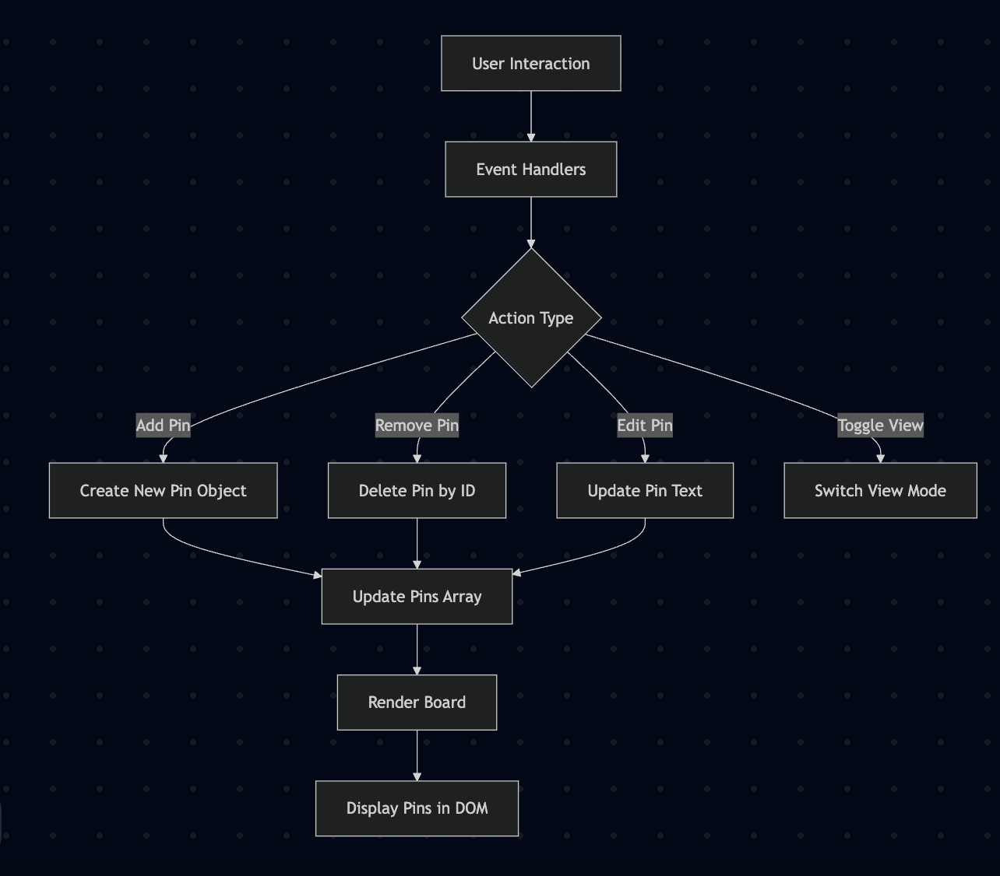

#Assignment 01

## Brief

Starting from the concept of a pinboard, implement a web page that:

- is responsive (properly layout for smartphone, tablet, and desktop)
- allows the user to add and remove elements
- allows the user to customize elements (i.e. colors, size)
- allows the switch between two views (at least)

 

## Project description
PinBoard is a minimal and intuitive digital board for collecting and managing short notes or ideas, just like sticky notes.
Each pin can be given a color and size, edited inline, or deleted with a simple “×”.
The layout can be toggled between list and grid (card) view, adapting responsively to the screen size.

The app relies entirely on vanilla JavaScript, manipulating the DOM directly and maintaining an internal array of pin objects as the “single source of truth.”

graph TD
  A[User Interaction] --> B[Event Handlers]
  B --> C{Action Type}
  C -->|Add Pin| D[Create New Pin Object]
  C -->|Remove Pin| E[Delete Pin by ID]
  C -->|Edit Pin| F[Update Pin Text]
  C -->|Toggle View| G[Switch View Mode]
  D --> H[Save to localStorage]
  E --> H
  F --> H
  H --> I[Render Board]
  I --> J[Display Pins in DOM]
...

## Function list
loadPins()

### loadPins()
Arguments: None
Description: Loads stored pins from localStorage (or returns an empty array if none are found).
Returns: Array of pin objects

### savePins()
Arguments: None
Description: Saves the current array of pins to localStorage.
Returns: void

### addPin(text)
Arguments: text (string) — The content to be added inside the new pin.
Description: Creates a new pin with text, color, and size, then renders it on the board.
Returns: void

### updatePin(id, patch)
Arguments:
id (string) — The unique identifier of the pin.
patch (object) — The properties to update (e.g., new text).
Description: Updates an existing pin’s properties (such as edited text).
Returns: void

### removePin(id)
Arguments: id (string) — The unique identifier of the pin.
Description: Removes a pin from the board and from memory.
Returns: void

### createPinNode(pin)
Arguments: pin (object) — The pin data object containing text, color, size, and ID.
Description: Dynamically builds a DOM element (div.pin) for each pin,
including the “×” delete button and the editable text area.
Returns: HTMLElement

### render()
Arguments: None
Description: Clears the board and re-renders all pins currently stored in memory.
Returns: void

### applyView()
Arguments: None
Description: Switches between Card View and List View by toggling CSS classes on the board.
Returns: void

## Licence
2025 (c) Giorgio Gaudio. All rights reserved. License: None