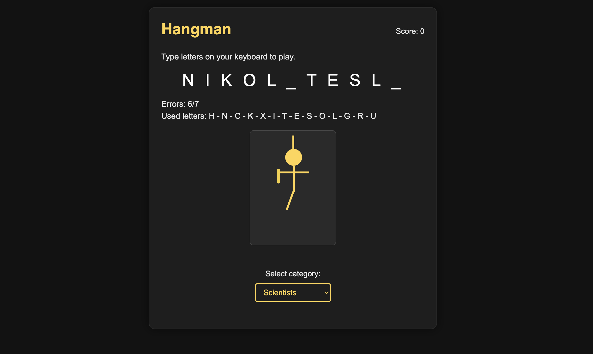
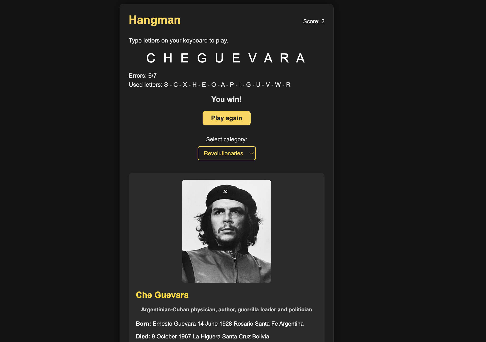

#Assignment 02

## Brief

Upgrade the Assignment 02 by adding the use of data coming from an external web API. For example, fetch contents (audio, images, video, text, metadata) from online archives, AI generated contents (chatGPT API), data (weather, realtime traffic data, environmental data).

The application **must** have those requirements:

- The webpage is responsive
- Use a web API (you choose which one best fists for your project) to load the data and display them in the webpage
- At least one multimedia file (for user feedback interactions, or content itself)
- Develop a navigation system that allows the user to navigate different sections with related content and functionalities

 

## Project description
A historical-figure-themed Hangman game that uses the API Ninjas database to fetch real characters and display their info. Players guess names, unlock biographical details, and see category-based animations, blending learning and gameplay in a fun, dynamic UI.

graph TD
A[Page_loads] --> B[Set_default_category]
B --> C[startGame]
C --> D[Pick_random_name]
D --> E[Fetch_API_data]
E --> F[Set_currentFigure_and_word]
F --> G[Show_hidden_word]
G --> H[User_inputs_letter]

H -->|Already_used| HU[Ignore]
H -->|Correct| I[Update_word]
H -->|Wrong| J[Increment_errors]

I --> K{Any_letters_left?}
K -->|Yes| H
K -->|No| L[Win]

L --> M[Increase_score]
M --> N[Show_win_message]
N --> O[Show_figure_info]
O --> P[Play_again]

J --> Q{errors_eq_3?}
Q -->|Yes| R[Show_category_item]
Q -->|No| H

J --> S{errors_eq_max?}
S -->|No| H
S -->|Yes| T[Lose]

T --> U[Show_correct_name]
U --> V[Play_again]

B --> W[Category_changed]
W --> X[Update_category]
X --> C

## Function list

### applyCategoryStyles()

Arguments: none
What it does: Removes previous category classes from the hangman container and applies the class for the current category (scientists, revolutionaries, philosophers).
Returns: void

### fetchFigureByName(name)

Arguments:

name (string)
What it does: Queries the Historical Figures API for the selected name (modified by category), extracts title and info, and prepares the data structure for the current figure. Falls back gracefully when no data is returned. Then starts the game with those details.
Returns: void

### fetchRandomFigureForCategory()

Arguments: none
What it does: Selects a random seed name from the chosen category and calls fetchFigureByName() with it.
Returns: void

### loadFigureImageFromWikipedia(name)

Arguments:

name (string)
What it does: Fetches the character’s image from Wikipedia’s REST API and displays it if available.
Returns: void

### updateWordDisplay()

Arguments: none
What it does: Joins the displayWord array into a spaced string and updates the DOM to show the guessed letters.
Returns: void

### showFigureInfo()

Arguments: none
What it does: Hides the hangman UI, shows the info card, composes an HTML block with all available figure details from the API, and loads the figure’s image.
Returns: void

### startGameWithFigure()

Arguments: none
What it does: Initializes the gameplay using the current figure data: sets the hidden word, resets arrays, resets errors, hides all hangman parts, hides category items (tool, cloud, beaker), and updates the UI.
Returns: void

### startGame()

Arguments: none
What it does: Prepares the UI for a new round, shows the hangman container, hides the info card, sets “Loading character…”, then fetches a new random figure based on the selected category.
Returns: void

### handleGuess(letter)

Arguments:

###letter (string)
What it does:
Validates the input letter (A–Z), prevents reuse, updates used letters, reveals correct letters or shows hangman parts on errors, triggers category-specific accessory on the 3rd error, checks win/lose conditions, and plays corresponding sounds.
Returns: void

### Event Listeners
Keyboard Event Listener

### document.addEventListener("keydown", ...)
Arguments: event (KeyboardEvent)
What it does: Captures the pressed key, converts it to uppercase, and passes it to handleGuess().
Returns: void

### Restart Button Listener

restartBtn.addEventListener("click", ...)
Arguments: none
What it does: Starts a new game by calling startGame().
Returns: void

### Category Select Listener

categorySelect.addEventListener("change", ...)
Arguments: none
What it does: Updates currentCategoryKey based on the user’s selection and immediately starts a new game.
Returns: void

## API documentation

https://api-ninjas.com/api/historicalfigures 

## Licence
2025 (c) Giorgio Gaudio. All rights reserved. License: None